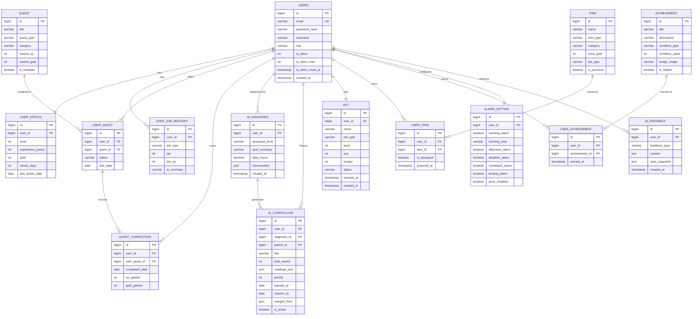

# SpecUp RPG 🎮⚔️
**포기하는 사람들을 위한, AI 맞춤형 성장 RPG 플랫폼**

> "의지가 없어도 굴러가게 만드는 시스템"

[](#)
[](#)
[](#)
[](#)

SpecUp RPG는 개발자, 취준생, 수험생 등 **시작이 어렵고 금방 포기하는 사람들**을 위한  
AI 기반 성장 관리 플랫폼입니다.  
할 일을 퀘스트로 등록하고, 캐릭터를 키우고, 펫을 돌보면서  
**게임 하듯 스펙을 쌓아가는 서비스**를 목표로 합니다.

**웹(Web)으로 먼저 출시 후, iOS / Android 네이티브 앱으로 확장 예정입니다.**  
하나의 계정으로 웹과 앱을 자유롭게 넘나들며 퀘스트를 이어갈 수 있습니다.

---

## 🔥 기획 배경

기존 할일 관리 앱(Habitica 등)은 **이미 동기가 있는 사람**을 위한 도구입니다.  
그러나 현실에서 대부분의 사람들은 이렇습니다.

- 시작하기까지 너무 오래 걸린다
- 막상 시작해도 며칠 못 간다
- 혼자서는 동기 유지가 어렵다
- 어디서부터 공부해야 할지 모른다

SpecUp RPG는 **AI가 지금 실력을 진단하고 커리큘럼을 짜주며, 알람과 펫이 끌어당기는** 구조로  
의지 없이도 꾸준히 성장할 수 있는 환경을 만듭니다.

---

## ✨ 핵심 기능

### 1️⃣ AI 레벨 진단 & 맞춤 커리큘럼 생성
가입 후 AI와 짧은 대화를 통해 현재 실력, 목표, 가용 시간을 파악합니다.

- 초보 개발자 → "HTML/CSS 기초부터 4주 커리큘럼 생성"
- 중급 개발자 → "Spring JPA 심화 6주 커리큘럼 생성"
- 수험생 → "정보처리기사 실기 D-60 집중 커리큘럼 생성"

> 개발자가 아니어도 괜찮아요. 디자이너, 공무원 준비생, 어학 학습자 등  
> AI가 대화를 통해 누구에게나 맞는 커리큘럼을 생성합니다.

---

### 2️⃣ RPG 퀘스트 시스템
일상의 할 일을 퀘스트로 전환합니다.

| 퀘스트 유형 | 설명 | 예시 |
|---|---|---|
| 일일 퀘스트 | 매일 초기화되는 기본 퀘스트 | "오늘 커밋 1회 하기" |
| 주간 퀘스트 | 주 단위 목표 퀘스트 | "알고리즘 문제 5개 풀기" |
| 도전 과제 | 장기 마일스톤 퀘스트 | "정보처리기사 합격" |
| AI 생성 퀘스트 | 커리큘럼 기반 자동 생성 | "JPA 연관관계 매핑 실습" |

퀘스트를 완료하면 **경험치(XP)와 골드**가 지급되고 캐릭터가 성장합니다.

---

### 3️⃣ 2축 레벨 시스템
단순한 레벨업이 아닌, **두 가지 축**으로 성장을 추적합니다.

```
계정 레벨 (Account Level)
└── 퀘스트 달성 누적 → 절대 리셋 없음 → 서비스 성실도 반영

직업 숙련도 (Job Mastery Tier 1~5)
└── AI 진단으로 초기값 설정 → 실력 수준 반영
    └── 중급 개발자 가입 시 → 계정 Lv.1 + 직업 Tier 3으로 시작
```

---

### 4️⃣ 목표 유연성 — 변경 / 병합 / 재조정

목표가 바뀌어도 걱정 없습니다.

- **목표 완전 전환** → 기존 커리큘럼 비활성화, AI 재진단 후 새 커리큘럼 생성
- **단기 목표 추가** → 기존 커리큘럼 일시정지, 단기 커리큘럼 병렬 진행 후 자동 복귀
- **목표 병합** → 비슷한 목표를 AI가 감지해 하나의 커리큘럼으로 통합 재조정
- **페이스 조정** → 재진단 없이 "이번 주 바빠요" 한마디로 퀘스트 양 조절

---

### 5️⃣ 캐릭터 & 펫 시스템

**캐릭터 커스텀**
- 골드로 구매하는 장비, 코스튬 (직업별 전용 스킨)
- 행동 기반 자동 부여 칭호 ("7일 연속 달성자", "새벽 4시 개발자")
- Tier 달성 시 해금되는 전용 프로필 테마

**펫 성장**
- 퀘스트를 깰수록 펫 알이 부화하고 성장
- 7일 연속 달성 시 펫 진화
- 3일 이상 방치 시 펫 컨디션 저하 → 복귀 유도 알람
- **AI 펫 대화** → 오늘 퀘스트 현황을 보고 펫이 한마디 건넴

> "오늘 커밋 아직 안 했죠? 저 배고파요 ㅠ"

---

### 6️⃣ AI 피드백 & 현실적 성장 예측

| 주기 | 내용 |
|---|---|
| 매일 밤 | 오늘 달성률, XP 획득, 펫 컨디션 요약 |
| 매주 일요일 | 주간 달성률, 아쉬운 점, 다음 주 커리큘럼 조정 제안 |
| 매월 말 | 성장 영역 분석, 현실적 위치 진단, 목표까지 예상 기간 |
| 매년 1월 | 1년 성장 그래프, 총 퀘스트 수, 공유 가능한 연간 회고 카드 |

> "현재 페이스(주 4회)면 6개월 후 Spring Boot 중급으로 취업 지원 가능해요.  
> 주 5회로 늘리면 4.5개월로 단축 가능해요."

---

### 7️⃣ 스마트 알람 시스템

강요가 아닌 **끌어당기는 알람** 설계를 지향합니다.

| 시간대 | 알람 유형 | 특징 |
|---|---|---|
| 오전 8시 | 오늘의 퀘스트 알림 | 펫 이름 포함, 감정 연결 |
| 오후 3시 | 중간 체크 | 미완료 유저에게만 발송 |
| 오후 9시 | 마감 알림 | 스트릭 숫자 노출, 손실 회피 심리 |
| 3일 침묵 | 복귀 알람 | 펫 컨디션 저하 알림 |
| 레벨업 직전 | 특별 알람 | "XP 50만 더 모으면 Lv.15!" |

---

### 8️⃣ 소셜 & 경쟁 요소

- **스터디 길드** → 같은 목표끼리 길드 결성, 길드 전체 달성률 보상
- **1:1 챌린지** → 친구와 주간 달성률 대결, 골드 베팅
- **주간 리더보드** → 직업별 XP 랭킹, 상위 10% 시즌 칭호
- **성장 피드** → 친구 레벨업, 퀘스트 완료 소식 공유 및 응원

---

## 🏗️ 시스템 아키텍처

```
         사용자
    ┌────┴────┐
    ▼         ▼
  Web        Mobile App
(React +   (iOS / Android)
TypeScript)     │
    │           │
    └─────┬─────┘
          ▼
  Spring Boot REST API   ← 웹/앱 공통 단일 API
     │            │
     ▼            ▼
 Claude API    Spring Scheduler
 (AI 진단,     (일일 퀘스트 초기화,
  커리큘럼,     알람 발송,
  피드백,       AI 피드백 생성)
  펫 대화)
          │
          ▼
       MariaDB
```

> **멀티플랫폼 전략**  
> - 1단계: React 반응형 웹 출시  
> - 2단계: PWA 설정으로 모바일 브라우저 최적화  
> - 3단계: React Native 또는 Capacitor로 iOS / Android 네이티브 앱 출시  
> - Backend REST API는 공통으로 사용 — 웹/앱 모두 동일한 API 엔드포인트

---

## 🗄️ 데이터베이스 설계

### ERD



### 테이블 설명

| 테이블 | 설명 | 핵심 설계 포인트 |
|---|---|---|
| `users` | 회원 정보 | AI 토큰 한도 & 충전 시각 관리 |
| `user_status` | 계정 레벨, XP, 골드, 스트릭 | 절대 리셋 없음 |
| `user_job_mastery` | 직업별 Tier & 숙련도 | 유저당 여러 직업 가능 |
| `quest` | 퀘스트 템플릿 | `category` 컬럼으로 카테고리 확장 |
| `user_quest` | 할당된 퀘스트 목록 | ASSIGNED / COMPLETED / EXPIRED |
| `quest_completion` | 퀘스트 완료 이력 | `UNIQUE(user_quest_id, completed_date)` 중복 방지 |
| `ai_diagnosis` | AI 진단 대화 이력 | 재진단 시 컨텍스트로 재사용 |
| `ai_curriculum` | AI 생성 커리큘럼 | `parent_id`로 병합/단기목표 트리 구조 |
| `ai_feedback` | AI 피드백 이력 | 일별/주별/월별/연별 타입 구분 |
| `pet` | 펫 성장 정보 | 방치 시 hunger 감소, 7일 연속 달성 시 진화 |
| `item` | 장비·코스튬 템플릿 | 직업별 전용 아이템, 프리미엄 구분 |
| `user_item` | 유저 보유 아이템 | `is_equipped`로 장착 상태 관리 |
| `achievement` | 칭호·배지 템플릿 | 숨겨진 업적(`is_hidden`) 포함 |
| `user_achievement` | 유저 획득 칭호 | 조건 달성 시 자동 부여 |
| `alarm_setting` | 알람 설정 | 유저별 알람 ON/OFF 개별 관리 |

### 중복 완료 방지 — 이중 방어 구조
```
1차 방어 (DB 레벨)
└── UNIQUE KEY (user_quest_id, completed_date)
    → 동일 퀘스트 하루 두 번 INSERT 시 DB에서 자동 차단

2차 방어 (서비스 레이어)
└── 완료 처리 전 status 검증
    → COMPLETED 상태인 퀘스트는 서비스에서 예외 처리
```

---

## 🛠️ 기술 스택

### Frontend (Web)
- **React** / **TypeScript**
- **Tailwind CSS** (반응형 UI)

### Mobile App
- **React Native** 또는 **Capacitor** (iOS / Android)
- 웹 코드 최대 재사용, 단일 코드베이스로 크로스플랫폼 대응
- 푸시 알람 (FCM — Firebase Cloud Messaging)

### Backend
- **Java** / **Spring Boot**
- **Spring Security** + **JWT** (인증/인가)
- **Spring Data JPA**
- **Spring Scheduler** (일일 퀘스트 초기화, 알람)

### Database
- **MariaDB**

### AI
- **Claude API** (AI 진단 대화, 커리큘럼 생성, 피드백, 펫 대화)

### DevOps
- **Docker** (예정)
- **AWS** (예정)

---

## 📦 프로젝트 구조

```
SpecUpRPG
 ┣ frontend
 ┃ ┣ components
 ┃ ┃ ┣ dashboard        # 메인 대시보드
 ┃ ┃ ┣ quest            # 퀘스트 카드, 완료 버튼
 ┃ ┃ ┣ character        # 캐릭터, 펫 UI
 ┃ ┃ ┣ curriculum       # 커리큘럼 진행도
 ┃ ┃ ┗ feedback         # AI 피드백 리포트
 ┃ ┣ pages
 ┃ ┣ hooks
 ┃ ┗ styles
 ┃
 ┣ backend
 ┃ ┣ domain
 ┃ ┃ ┣ user             # 회원, 상태, 직업 숙련도
 ┃ ┃ ┣ quest            # 퀘스트, 완료 이력
 ┃ ┃ ┣ curriculum       # AI 커리큘럼
 ┃ ┃ ┣ pet              # 펫 성장
 ┃ ┃ ┗ alarm            # 알람
 ┃ ┣ controller
 ┃ ┣ service
 ┃ ┣ repository
 ┃ ┣ scheduler          # 일일 초기화, 알람 발송
 ┃ ┗ infra
 ┃   ┗ claude           # Claude API 연동
 ┃
 ┗ README.md
```

---

## 🖼️ 서비스 화면

> 개발 진행 후 스크린샷을 추가해 주세요.

| 화면 | 설명 |
|---|---|
|  | AI 진단 대화 온보딩 화면 |
|  | 메인 대시보드 — 퀘스트 목록, 캐릭터 상태 |
|  | 퀘스트 완료 및 XP 획득 |
|  | 캐릭터 & 펫 커스텀 화면 |
|  | AI 주간 피드백 리포트 |
|  | 커리큘럼 진행도 및 목표 변경 |

---

## 🚀 개발 단계

### 1단계 — MVP (현재)
- [ ] 회원가입 / 로그인 (JWT)
- [ ] AI 진단 대화 및 커리큘럼 생성 (Claude API)
- [ ] 일일/주간 퀘스트 시스템
- [ ] XP, 골드, 레벨업 로직
- [ ] 메인 대시보드 UI (반응형)
- [ ] 기본 알람 (하루 마감 리포트)

### 2단계 — 성장 요소
- [ ] 캐릭터 커스텀 (장비, 코스튬)
- [ ] 펫 시스템 (성장, 진화, AI 대화)
- [ ] 칭호 & 배지 자동 부여
- [ ] 목표 변경 / 병합 / 재조정
- [ ] 주간 / 월간 AI 피드백 리포트

### 3단계 — 모바일 앱 & 소셜 확장
- [ ] PWA 설정 (모바일 브라우저 최적화)
- [ ] React Native 또는 Capacitor 앱 개발
- [ ] iOS / Android 앱스토어 출시
- [ ] 푸시 알람 (FCM 연동)
- [ ] 스터디 길드
- [ ] 1:1 챌린지
- [ ] 주간 리더보드
- [ ] 연간 회고 카드 생성 및 공유

---

## 🎯 프로젝트 목표

이 프로젝트는 단순한 CRUD 서비스가 아닙니다.

- **멀티플랫폼 설계** — 단일 REST API로 웹 / iOS / Android 동시 대응 구조
- **AI API 연동** — Claude API를 활용한 동적 커리큘럼 생성 및 피드백
- **복잡한 비즈니스 로직** — 레벨/Tier 2축 구조, 목표 병합/재조정, 중복 방지 이중 방어
- **데이터 기반 성장 추적** — 유저 행동 데이터를 분석한 현실적 성장 예측
- **유저 리텐션 설계** — 펫, 알람, 피드백으로 이탈 방지 구조 설계
- **실제 배포 경험** — Docker + AWS 배포

> "동작하는 코드를 넘어, 유저가 오래 머무는 서비스를 설계하는 개발자"를 목표로 합니다.

---

## 💡 프로젝트 동기

결심하기까지 오래 걸리고, 막상 시작해도 며칠 못 가는 사람들이 있습니다.  
동기가 없으면 추진력이 생기지 않는 사람들 — 사실 대부분의 사람들이 그렇습니다.

> "의지가 있어야 쓸 수 있는 앱이 아니라,  
> 앱이 의지를 만들어주는 서비스"

게임 퀘스트를 깨듯 하루하루 하다 보면,  
어느새 스펙이 쌓여 있는 경험을 만들고 싶어 이 프로젝트를 시작했습니다.

---

## 🧑‍💻 개발자

**Backend Developer**
- Java / Spring Boot / Spring Security / JPA
- AI API 연동 (Claude API)
- Database Design & 복잡한 비즈니스 로직 설계
- 기계공학과 → 컴퓨터과학과 편입 / 풀스택 프로젝트 팀장 경험

---

## 📜 License

MIT License
